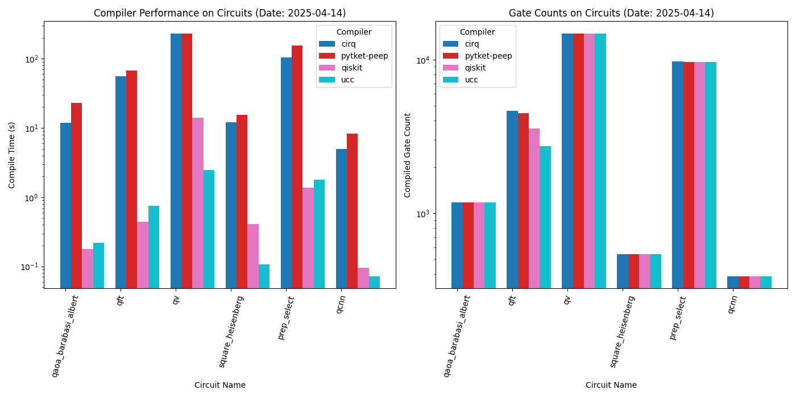
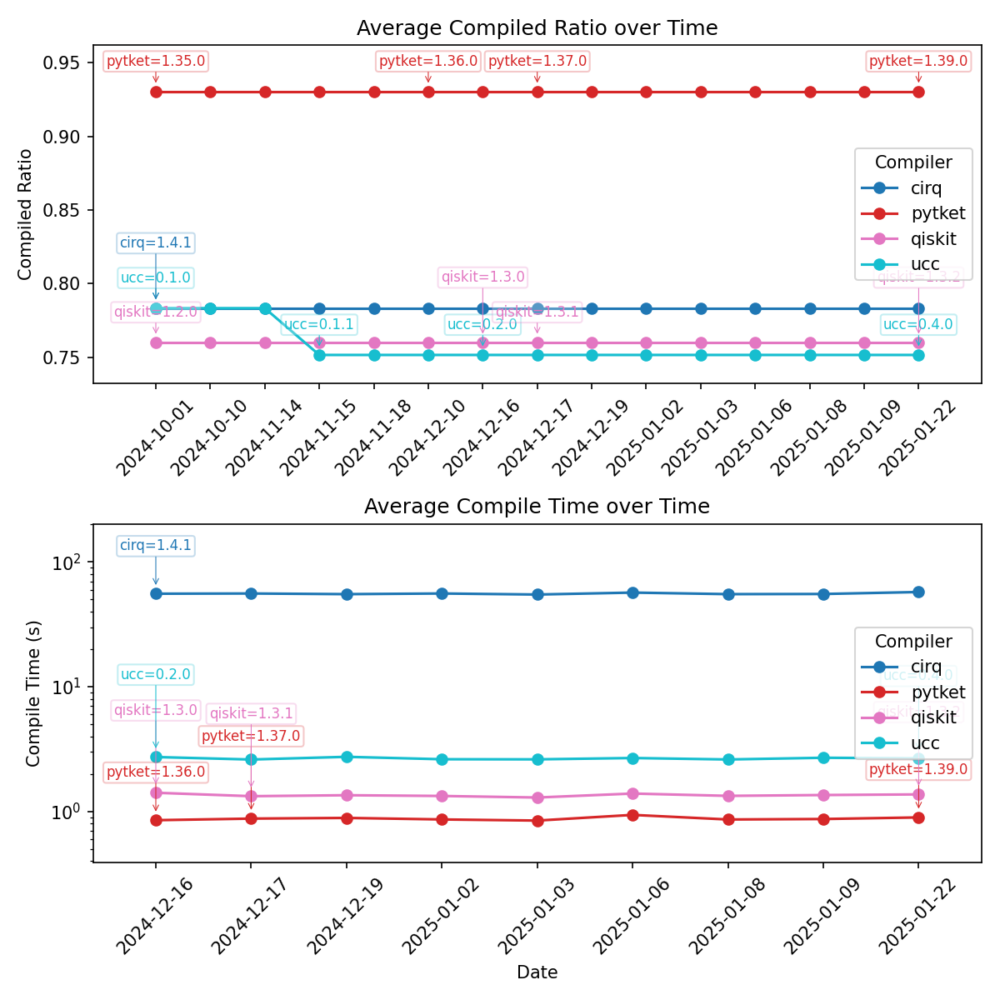

## `ucc`: Unitary Compiler Collection

[](https://github.com/unitaryfund/ucc)
[](https://unitary.foundation)
[](http://discord.unitary.foundation)


The **Unitary Compiler Collection (UCC)** is a Python library for frontend-agnostic, high performance compilation of quantum circuits. 

UCC interfaces automatically with multiple quantum computing frameworks, including [Qiskit](https://github.com/Qiskit/qiskit), [Cirq](https://github.com/quantumlib/Cirq), and [PyTKET](https://github.com/CQCL/tket) and supports programs in OpenQASM 2 and [OpenQASM 3](https://openqasm.com/). For a full list of the latest supported interfaces, just call `ucc.supported_formats`.


**Want to know more?** 
- Check out our documentation, which you can build locally after installation by running `make html` in `ucc/docs/source`.
- For code, repo, or theory questions, especially those requiring more detailed responses, submit a [Discussion](https://github.com/unitaryfund/ucc/discussions).
- For casual or time sensitive questions, chat with us on [Discord](http://discord.unitary.foundation).

## Quickstart

### Installation

```bash
pip install ucc
```

or install a dev version!
```bash
git clone https://github.com/unitaryfund/ucc.git
cd ucc
pip install -e . # Editable mode
```

### Example with Qiskit, Cirq, and PyTKET

Define a circuit with your preferred quantum SDK and compile it!

```python
from ucc import compile

from pytket import Circuit as TketCircuit
from cirq import Circuit as CirqCircuit
from qiskit import QuantumCircuit as QiskitCircuit
from cirq import H, CNOT, LineQubit

def test_tket_compile():
    circuit = TketCircuit(2)
    circuit.H(0)
    circuit.CX(0, 1)
    compile(circuit)

def test_qiskit_compile():
    circuit = QiskitCircuit(2)
    circuit.h(0)
    circuit.cx(0, 1)
    compile(circuit)

def test_cirq_compile():
    qubits = LineQubit.range(2)
    circuit = CirqCircuit(
        H(qubits[0]), 
        CNOT(qubits[0], qubits[1]))
    compile(circuit)
```
<!-- start-how-does-ucc-stack-up -->
## How does UCC stack up?

We run benchmarks regularly to compare against the most recent versions of the most popular quantum compiler frameworks for a range of circuits. Here's the latest:

And here you can see progress over time (changes usually indicate a newer version came out):

Note that the compile times before 2024-12-10 may have been run on different classical compute instances, so their exact runtime is not as important to compare as their relative performance with respect to other compilers.
After 2024-12-10, all data present in this plot should be run on the same compute instance using our [ucc-benchmarks](https://github.com/unitaryfund/ucc/blob/main/.github/workflows/ucc-benchmarks.yml) GitHub Actions workflow. 
<!-- end-how-does-ucc-stack-up -->

## Benchmarking

You can benchmark the performance of ucc against other compilers using `./ucc/benchmarks/scripts/run_benchmarks.sh`. This script runs compiler benchmarks in parallel, so you will need to first install `parallel` to support it.    

On Mac you can do this with `brew install parallel`. 

## Contributing

We’re building UCC as a community-driven project.
Your contributions help improve the tool for everyone!
There are many ways you can contribute, such as

- **Create a Custom Compiler Pass**: Learn how in the [User Guide](https://ucc.readthedocs.io/en/latest/user_guide.html)
- **Submit a bug report or feature request**: Submit a bug report or feature request [on GitHub](https://github.com/unitaryfund/ucc/issues/new/choose).
- **Contribute Code**: Follow the [Contribution Guide](https://ucc.readthedocs.io/en/latest/contributing.html) to submit new passes and improvements.

If you have questions about contributing please ask on the [Unitary Foundation Discord](http://discord.unitary.foundation).

## License

UCC is distributed under [GNU Affero General Public License version 3.0](https://www.gnu.org/licenses/agpl-3.0.en.html)(AGPLv3). 
Parts of ucc contain code or modified code that is part of Qiskit, which is distributed under Apache 2.0 license.
